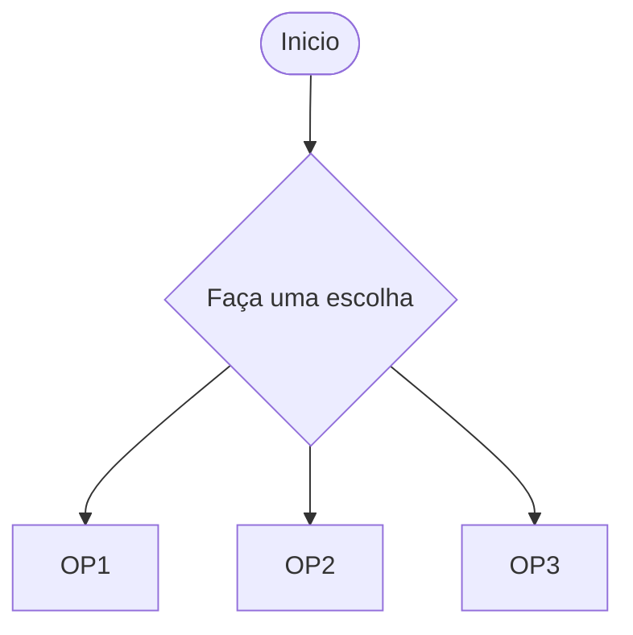
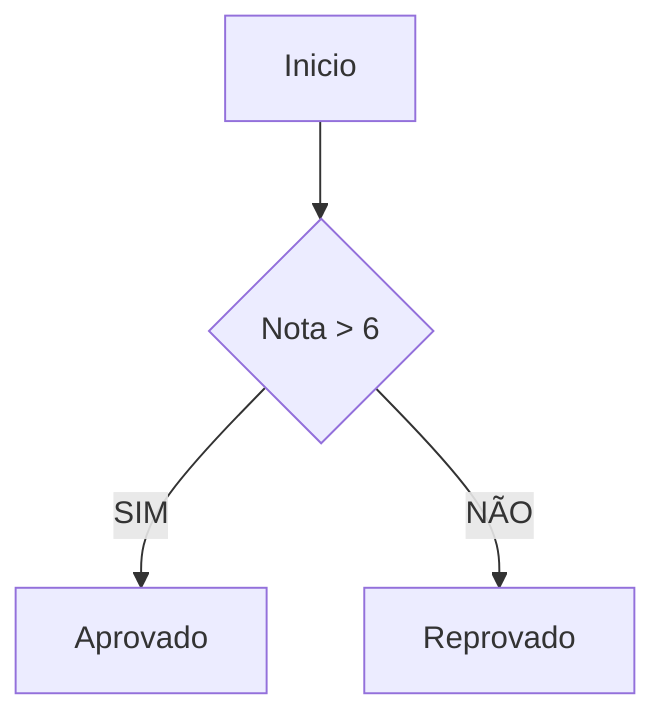
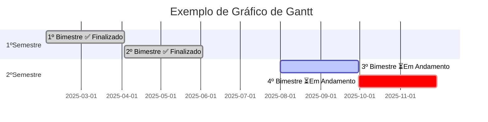
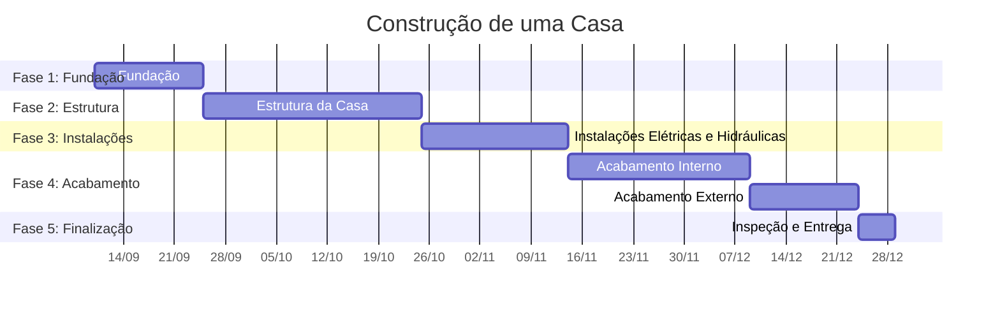

```mermaid
flowchart TD
  A(["Inicio"])
  A --> B{"Faça uma escolha"}
  B --> C["OP1"]
  B --> E["OP2"]
  B --> D["OP3"]
```

```mermaid
graph TD;
A[Inicio] --> B{Nota > 6};
B --> |SIM| C[Aprovado];
B --> |NÃO| D[Reprovado];
```

```mermaid
gantt
  title Exemplo de Gráfico de Gantt
  dateFormat YYYY-MM-DD
  section 1ºSemestre
  1º Bimestre ✅ Finalizado:done, a1, 2025-02-02, 60d
  2º Bimestre ✅ Finalizado:done, a2, after a1, 60d
  section 2ºSemestre
  3º Bimestre ⏳Em Andamento:active, a3, 2025-08-01, 60d
  4º Bimestre ⏳Em Andamento:crit, a4, after a3, 60d
```
Exercício não avaliativo

```mermaid
gantt
    title Construção de uma Casa
    dateFormat DD-MM-YYYY
    axisFormat %d/%m

    section Fase 1: Fundação
    Fundação :a1, 10-09-2025, 15d

    section Fase 2: Estrutura
    Estrutura da Casa :a2, after a1, 30d

    section Fase 3: Instalações
    Instalações Elétricas e Hidráulicas :a3, after a2, 20d

    section Fase 4: Acabamento
    Acabamento Interno :a4, after a3, 25d
    Acabamento Externo :a5, after a4, 15d

    section Fase 5: Finalização
    Inspeção e Entrega :a6, after a5, 5d
```
