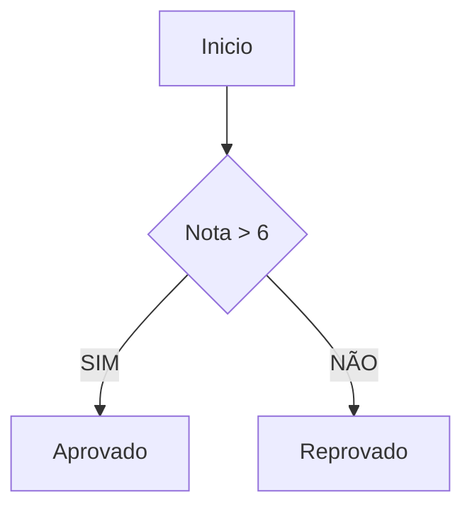
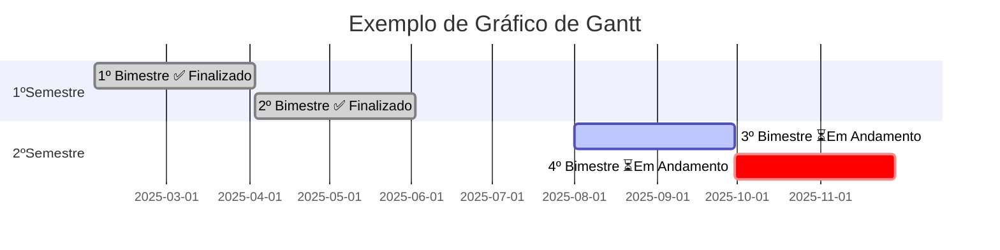
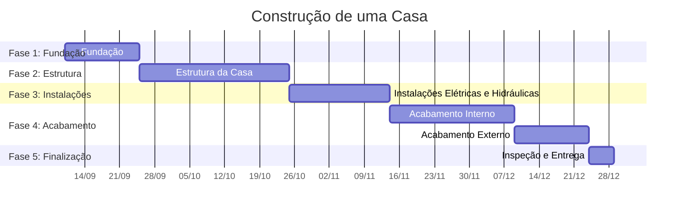

Exercício não avaliativo


```mermaid
gantt
    title Projeto: Sistema de Cadastro de Empresas
    dateFormat  YYYY-MM-DD
    axisFormat %W

    %% Fases do Projeto (Início: 06/10/2025)

    section Fase 1: Planejamento e Análise
    Levantamento de Requisitos    :crit, done, req, 2025-10-06, 1w
    Documentação Funcional        :done, doc, 2025-10-06, 10d

    section Fase 2: Design de Interface (UI/UX)
    Elaboração de Wireframes      :done, wire, after req, 1w
    Criação do Layout Definitivo  :done, layout, after wire, 2w

    section Fase 3: Configuração e Desenvolvimento
    Config. Ambiente e Git        :crit, done, env, 2025-10-06, 1w
    Criação do Banco de Dados     :done, db, after env, 1w
    Entrega 1: Módulo de Login   :active, login, 2025-10-20, 2w
    Entrega 2: CRUD de Empresas   :crud, 2025-11-03, 3w
    Entrega 3: Upload de Logotipo :upload, 2025-11-24, 2w
    Entrega 4: Relatórios         :reports, 2025-12-08, 2w
    Entrega 5: Painel Admin       :admin, 2025-12-22, 2w

    section Fase 4: Testes e Validação
    Testes Unitários e Integração :crit, test_cont, 2025-10-20, 18w
    Testes de Usabilidade         :test_ux, after admin, 2w
    Correção de Bugs              :bugs, after test_ux, 6w

    section Fase 5: Implantação e Encerramento
    Prep. Ambiente de Produção    :deploy_prep, 2026-03-02, 1w
    Implantação Final (Go-live)   :go_live, after deploy_prep, 1w
    Validação e Treinamento       :training, after go_live, 1w
    Encerramento do Projeto       :close, after training, 1w
```
