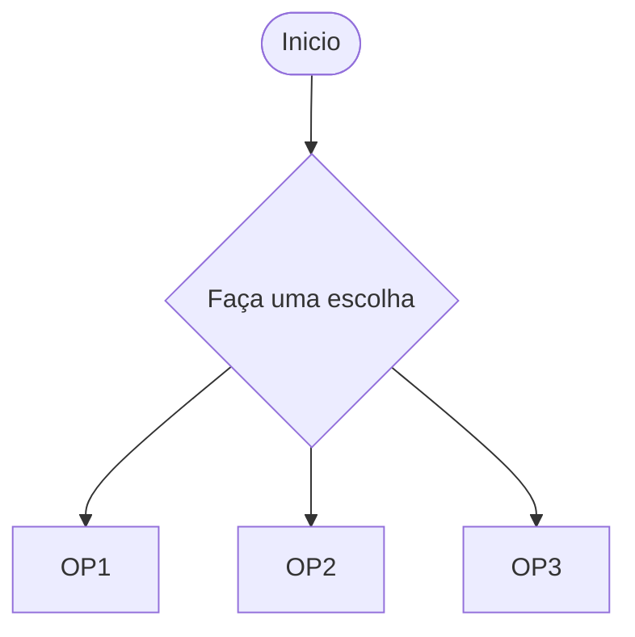
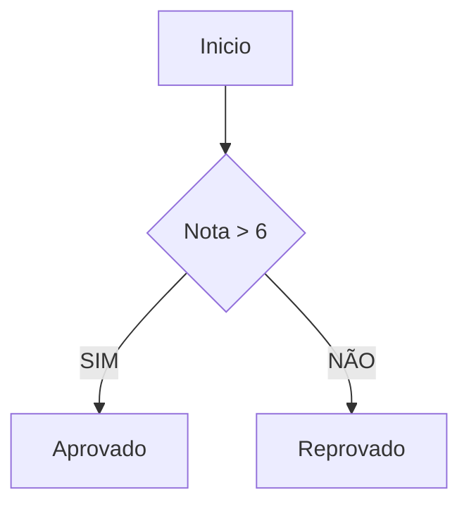
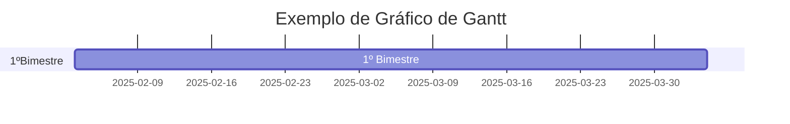

```mermaid
flowchart TD
  A(["Inicio"])
  A --> B{"Faça uma escolha"}
  B --> C["OP1"]
  B --> E["OP2"]
  B --> D["OP3"]
```

```mermaid
graph TD;
A[Inicio] --> B{Nota > 6};
B --> |SIM| C[Aprovado];
B --> |NÃO| D[Reprovado];
```

```mermaid
gantt
  title Exemplo de Gráfico de Gantt
dateFormat YYYY-MM-DD
section 1ºBimestre
1º Bimestre: a1, 2025-02-03, 60d
section 2ºBimestre
```
